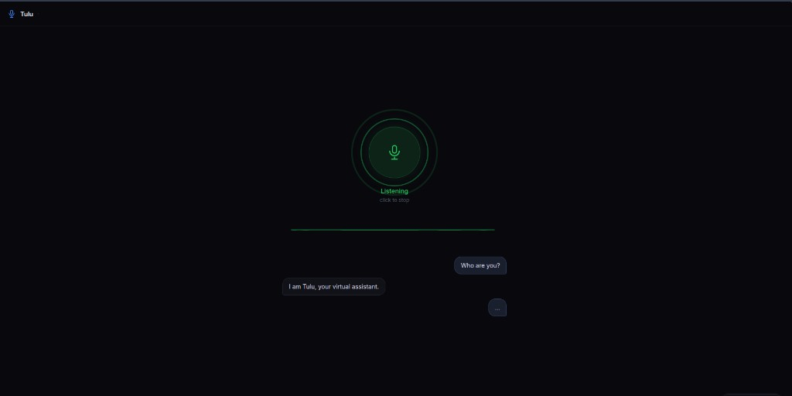

# Tulu🎙️



**Full-duplex voice agent** - talk to an AI in real time, interrupt it mid-sentence, and get responses in ~900ms.

Built from scratch without LiveKit, Twilio, or any voice-agent framework. Just raw WebSockets, browser Web Audio API, and a tight STT → LLM → TTS pipeline.

```
Your mic → VAD → Deepgram STT → Groq LLM → Cartesia TTS → Your speakers
              ↑                                               ↓
              └───────── interruption detection ─────────────┘
```

> **Beta:** Tulu is under active development. Core conversations work well but you may run into rough edges listed below.

**Known issues:**

- In loud environments the adaptive VAD can still misfire until it finishes calibrating (first ~5 seconds)
- Occasional agent silence after an interruption if the echo cooldown overlaps with your next utterance — just speak again
- Very fast speakers may get clipped on the first word if the browser AudioWorklet takes a frame or two to warm up

---

## Features

- **Full duplex** - agent listens while speaking; you can interrupt at any time
- **Adaptive VAD** - noise floor auto-calibrates to your room; no fixed threshold
- **Semantic endpointing** - fires on complete sentences, waits on mid-thought pauses
- **Backchannel filter** - "yeah / okay / uh-huh" doesn't spin up a full LLM call
- **Preemptive generation** - LLM starts as soon as Deepgram confirms a final transcript
- **Thinking audio** - soft pulsing tone during processing so dead-air gaps feel shorter
- **Echo protection** - mic audio is gated during agent speech; 400ms cool-down after
- **Live metrics** - per-turn endpointing / LLM TTFT / TTS TTFA dashboard in the UI
- **Groq / OpenAI / Ollama** - swap LLM providers via a single env var

---

## How it works

### Audio pipeline

The browser captures mic audio at 16kHz via `getUserMedia` with echo cancellation enabled. An `AudioWorklet` converts `Float32` samples to `Int16 PCM` and calculates RMS energy every 20ms. RMS feeds an adaptive VAD that maintains a live noise floor estimate and triggers only when audio exceeds `noiseFloor × 4.5`.

### Endpointing

When VAD detects silence, the server checks the current transcript:

- Ends with `.?!` → **fire immediately** (semantic endpoint)
- Ends with `and/but/um` → **wait for Deepgram UtteranceEnd** (mid-thought)
- Otherwise → 200ms grace timer

If a Deepgram `final` result arrives while the timer is running, the timer is cancelled and the pipeline fires immediately (preemptive generation).

### STT → LLM → TTS concurrency

LLM and TTS run as two concurrent async tasks sharing a sentence queue. TTS streams audio for sentence 1 while the LLM is already generating sentence 2 — true pipeline parallelism.

### Interruption

If VAD fires for 300ms while the agent is speaking, the pipeline is cancelled, the browser flushes its audio queue, and the agent goes back to LISTENING. A 400ms echo cool-down prevents the agent's own voice from re-triggering.

---

## Engineering

Most voice agent demos feel like they are running through a call center. There is a long pause after you speak, a beep, and then a robotic reply. That pause is not a hardware limitation. It is the product of a naive pipeline where every step waits for the previous one to finish completely before starting.

Tulu started as a question: how short can that gap actually get if you treat latency as a first-class constraint from the start, not an afterthought?

### The architecture

There are three real moving parts.

**STT (Deepgram Nova-2)** runs as a persistent WebSocket connection that receives audio frames in real time and streams back partial transcripts while you are still speaking. By the time you finish a sentence, you already have most of the words. Nova-2 over Nova-3 was a deliberate choice after benchmarking: it has lower partial streaming latency in practice, which matters more here than peak accuracy.

**LLM (Groq)** takes the transcript and streams tokens back. Groq's inference hardware gives consistently lower time-to-first-token compared to OpenAI on the same model size. The system prompt enforces one-sentence replies and a hard token cap, which keeps the LLM from rambling and cuts TTS work down significantly.

**TTS (Cartesia Sonic-2)** does not wait for the full LLM response. The backend splits the token stream into sentences as they arrive and sends each sentence to Cartesia immediately. Audio for sentence one is already playing in the browser while the LLM is still generating sentence two. This sentence-level pipeline parallelism is responsible for a large chunk of the perceived speedup.

The browser handles mic capture at 16kHz via an AudioWorklet that converts Float32 samples to Int16 PCM every 20ms and streams them over a WebSocket to the backend. Everything runs over two persistent WebSocket connections: one for audio in, one for control messages and audio out.

### The hard problems

**Endpointing.** Knowing when a user has finished speaking is genuinely difficult. A fixed silence timer works but feels sluggish. The approach here is layered: if the partial transcript ends with `.?!`, the pipeline fires without waiting. If it ends with a hedge word like "and", "but", or "um", it waits for Deepgram's own UtteranceEnd signal. Otherwise a 200ms grace timer starts. If a Deepgram final result arrives during those 200ms, the timer is cancelled and the pipeline fires immediately. This combination cut perceived endpointing latency from about 900ms down to roughly 300ms on average.

(Note:This is not a optimal way ik. I am exploring more ways to make endpointing optimal)

**Echo.** After the agent finishes speaking, the microphone picks up the tail of that audio and Deepgram sees it as new user speech. The fix is two layers: mic audio is only transmitted to the server when the state is LISTENING or INTERRUPTED, and a 400ms cooldown on the server blocks VAD from triggering right after agent speech ends. Without this, the agent would constantly interrupt itself.

**Adaptive VAD.** A fixed RMS threshold for voice detection works in a quiet room and nowhere else. Background noise, fans, AC, anything with consistent energy trips a static threshold constantly. The VAD here tracks a rolling noise floor using an exponential moving average and sets the speech threshold dynamically as a multiple of that floor. The agent calibrates itself to wherever you are within a few seconds of starting.

---

## Latency


| Component                          | Time       |
| ---------------------------------- | ---------- |
| You stop speaking → endpoint fires | ~450ms     |
| Groq TTFT                          | ~200ms     |
| Cartesia first audio               | ~300ms     |
| **Perceived E2E**                  | **~900ms** |


---

## Prerequisites

- Python 3.11+
- API keys for [Deepgram](https://console.deepgram.com), [Cartesia](https://play.cartesia.ai), and [Groq](https://console.groq.com) (all have free tiers)
- A browser with microphone access (Chrome / Edge recommended)

---

## Setup

```bash
git clone https://github.com/your-username/tulu
cd tulu

# 1. Copy and fill in your keys
cp .env.example .env
# edit .env with your API keys

# 2. Install dependencies and start
chmod +x run.sh
./run.sh
```

Open **[http://localhost:8000](http://localhost:8000)**, click **Start**, and start talking.

---

## Manual setup (without run.sh)

```bash
cd backend
pip install -r requirements.txt
python -m uvicorn main:app --host 0.0.0.0 --port 8000
```

---

## Configuration

All config lives in `.env`. The most important options:

```env
# Switch LLM provider
LLM_PROVIDER=groq          # groq | openai | local

# Use a different Groq model
GROQ_MODEL=llama-3.1-8b-instant

# Use a custom Cartesia voice
CARTESIA_VOICE_ID=your_voice_id_here
```

## Roadmap

- **Silero VAD on the server** — replace Deepgram's built-in `vad_events` with a locally-run Silero model (small CNN, ~1ms per frame) for probability-based speech detection that is more robust to transient noise and doesn't depend on the STT provider's internal heuristics
- **Speaker demotion during interruption** — instead of hard-cancelling TTS on barge-in, fade out gracefully and resume from context if the interruption turns out to be a backchannel
- **Conversation memory** — summarize older turns into a rolling context window so the agent remembers things said earlier in a long session without blowing up the token count

---

## License

MIT — see [LICENSE](LICENSE).